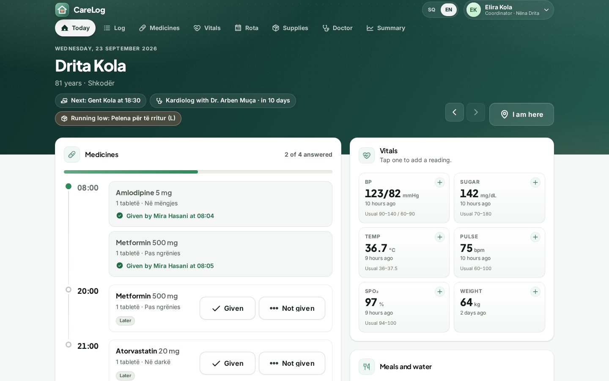
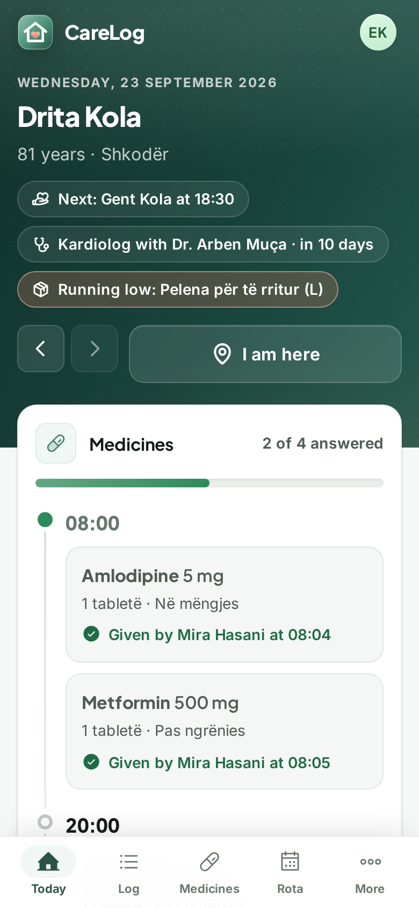
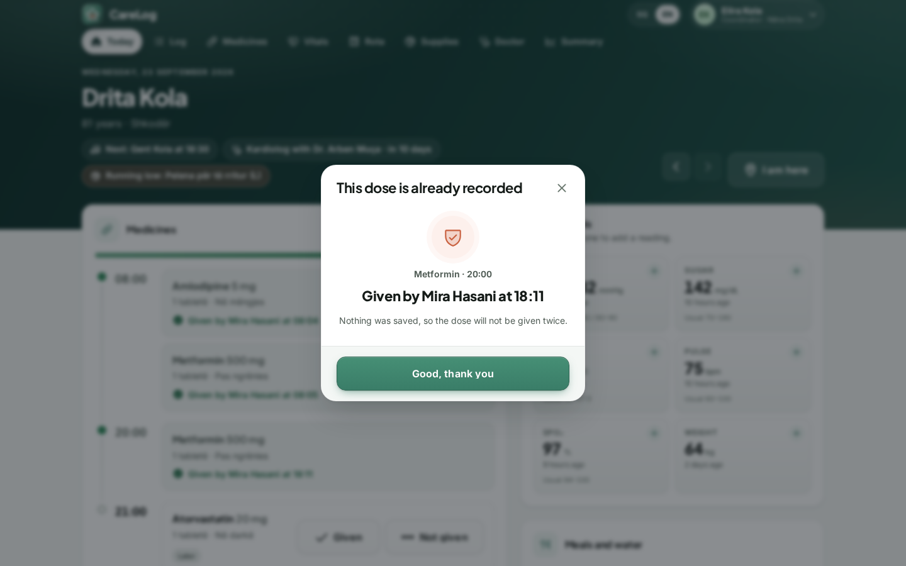
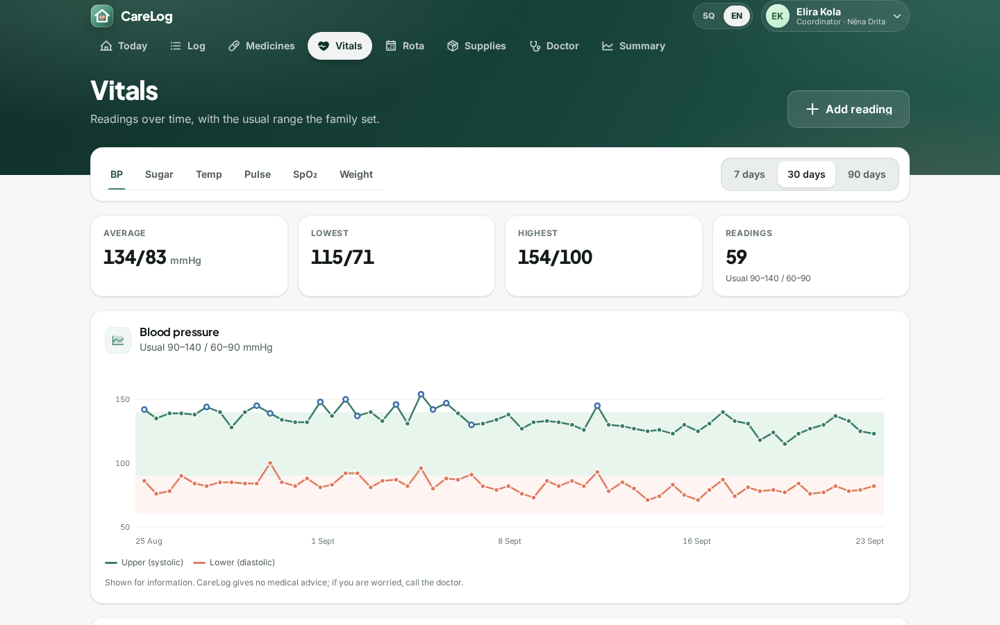
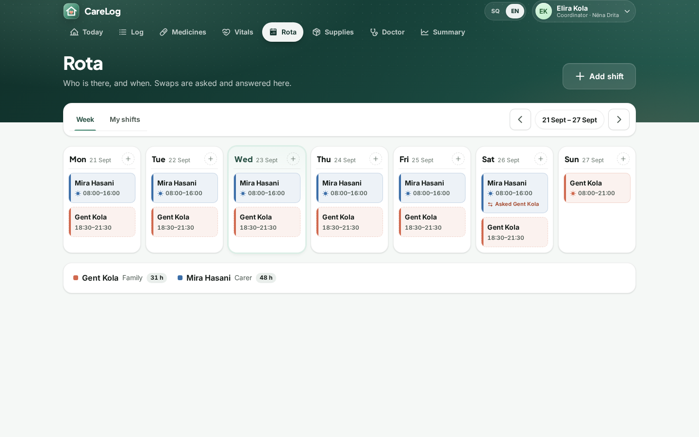
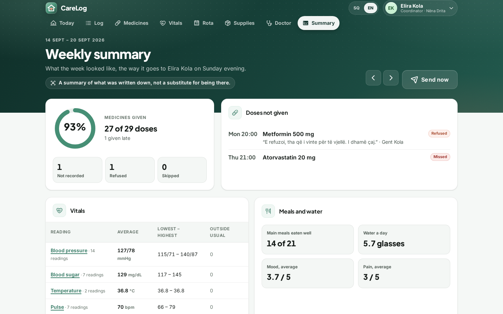
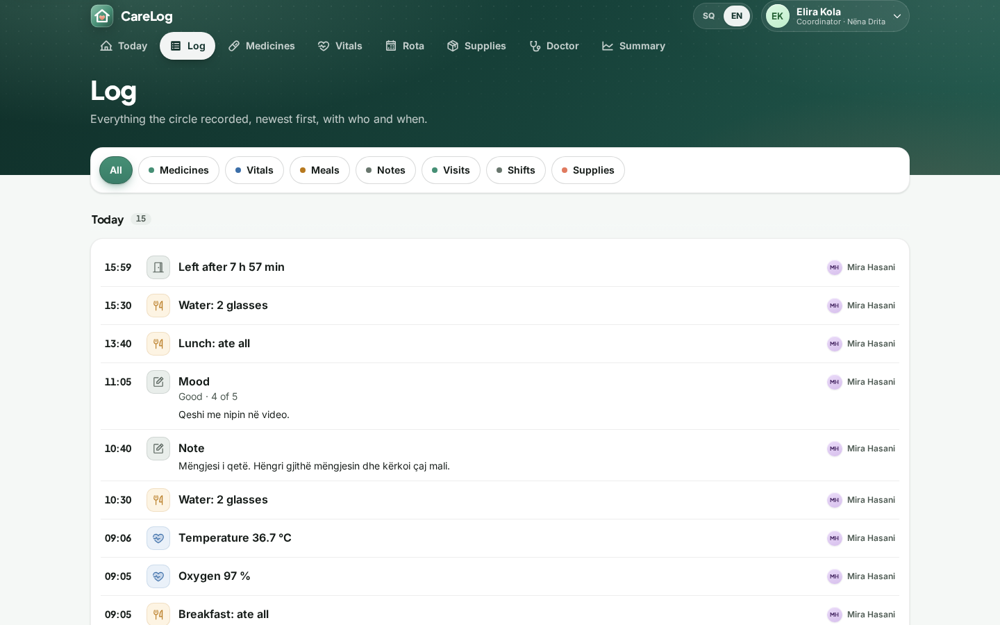
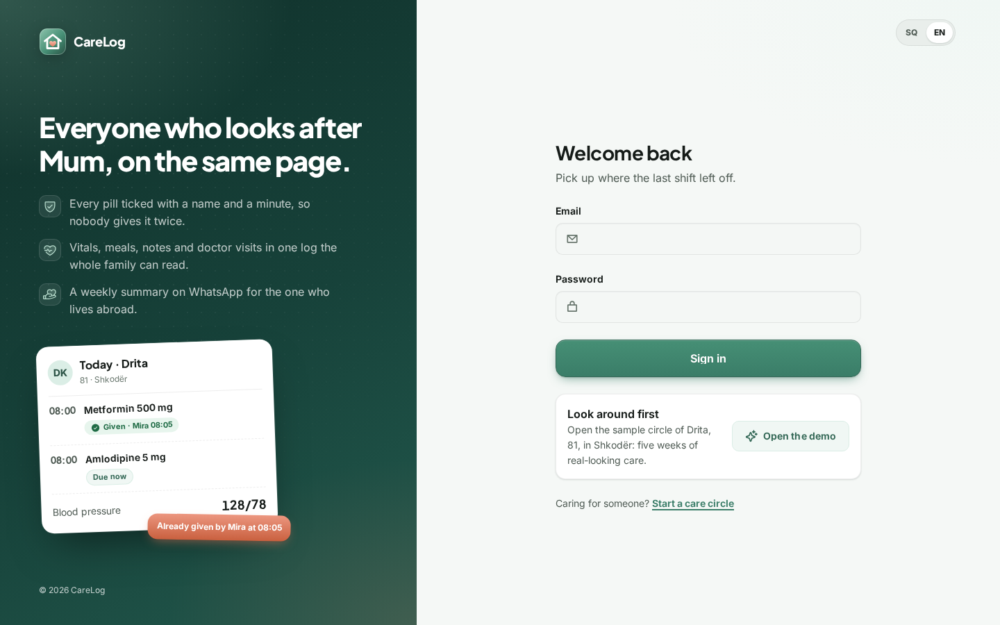

# CareLog

A shared care log for the people looking after an elderly parent: every pill ticked with a name
and a minute, vitals and meals in one place, a duty rota, and a weekly WhatsApp summary for the
child who lives abroad.

<p>
  
  
</p>

## Why

When a parent grows old or ill, care is spread over three to six people: a sibling nearby, a
spouse, a paid carer, a neighbour, children working in Italy or Germany. Nobody writes down
whether the 8 a.m. pill was given, what Tuesday's blood pressure was, what the doctor said, or
who is on duty on Friday, and a WhatsApp group scrolls those facts out of sight in minutes.
Doses get doubled or missed, the child abroad hears "she is fine" until the hospital calls, and
when the main carer is off sick the substitute knows nothing. CareLog is the one log the whole
circle keeps together, and for the hired carer it is her proof of work.

## What it does

- **Daily card** (phone first): the elder's header, who is on duty, check in and out with
  optional GPS, a medicine timeline with one big *Given* button per dose, *late* and
  *not recorded* states after a grace period, skip or refused with a reason, quick vitals with
  the last value and the circle's usual range, meals and glasses of water, mood and pain,
  notes and incidents with a photo. Every entry carries who and when.
- **Double-dose guard**: a scheduled dose can be recorded once. A second tap anywhere gets
  "Already given by Mira at 08:05" and nothing is saved.
- **Log**: everything the circle recorded, newest first, grouped by day, with filters for
  medicines, vitals, meals, notes, visits, shifts and supplies.
- **Medicines**: daily, weekly or as-needed schedules with time chips, a photo of the box,
  stop with a reason, a two-week dose grid and the full history of changes (who changed the
  strength from 2.5 to 5 mg, and when).
- **Vitals**: blood pressure, sugar, temperature, pulse, oxygen and weight as charts with the
  usual range drawn as a band, plus the readings table.
- **Rota**: a week of shifts in seven columns, weekly repeats, "my shifts", and swap requests
  that the other person accepts or declines (they are told on WhatsApp).
- **Supplies**: one tap between *enough*, *running low* and *out*; low items message the
  coordinator.
- **Doctor visits**: what the doctor said, the prescription photo, and the next appointment,
  which also shows on the daily card.
- **Weekly summary**: adherence, doses not given, vitals min/avg/max, meals, notable notes,
  low supplies and hours on duty (rota against check-ins). Sent to the payer on Sunday at
  19:00 circle time, or with *Send now*; the message says it is a summary, not a substitute
  for being there.
- **Circle**: the elder's profile (conditions, allergies, family doctor, emergency contacts),
  members and roles, join links per role, the plan and who pays, care settings and usual ranges.
  A new circle starts with a short two-step setup of the elder.
- **Offline**: writes from the daily card wait on the phone with the real time of the action
  and sync when the connection returns; the band shows what is waiting or was refused.
- **Roles**: coordinator, family, carer and viewer (read-only). English and Albanian throughout,
  including the WhatsApp messages, which go out in each reader's language.

<p>
  
  
</p>
<p>
  
  
</p>
<p>
  
  
</p>

## How it works

- **Which doses are due** (`DoseSchedule`): a medicine is due on a day if the day is inside
  its start and end dates and, for weekly medicines, on one of its weekdays. A medicine stopped
  at 12:40 still owes that morning's dose but not the evening one. As-needed medicines have no
  schedule; each dose is recorded when it is given, and the card shows when it was last given.
- **Late and missed** (`DoseTiming`): a dose is *due* from an hour before its time, *late* once
  the circle's grace period (15 to 90 minutes, 30 by default) is over, and *not recorded* two
  hours after its time. Two hours is also when the optional WhatsApp alert goes to the
  coordinator, once per dose. A dose given after the grace period counts as given, marked late.
- **The guard**: a unique index on medicine + day + scheduled time backs the rule in the
  database, so two phones tapping at the same moment cannot both win. The loser gets a 409 with
  who recorded the dose and when, and the app shows it in a dialog.
- **Offline**: each write from the daily card carries a `clientId` and the moment it happened.
  Queued writes are replayed oldest first when the phone is back online; the server logs the
  original time and recognises a retry by its `clientId` instead of doubling it. A write the
  server refuses on arrival (someone else gave that dose meanwhile) is shown, not lost.
- **Weekly summary** (`WeeklyReportBuilder`): counts every dose that was due up to the moment
  of the summary (a Sunday 19:00 message does not count the 20:00 dose), adherence is given
  over given + skipped + refused + not recorded. Meals count the last entry per meal, water is
  averaged over days with entries, notable notes are incidents, pain 4-5 and mood 1-2, and
  hours on duty put the rota next to what check-ins prove.
- **Plans**: Free has two members and shows 30 days of history; older entries are kept, only
  hidden, so switching to Family brings them back. An open join link takes a seat. There is no
  real payment in this version: the coordinator switches plans in the app.
- **No medical advice**: usual ranges are the family's numbers, shown next to readings for
  information only. CareLog never suggests or decides a dose.

## Stack

- Backend: Java 17, Spring Boot 4.1 (Web MVC, Data JPA, Security with session cookies and
  CSRF, Spring Session JDBC), PostgreSQL, Flyway, Maven wrapper.
- Frontend: Vue 3.5, Vite 8, TypeScript, Pinia, vue-router, vue-i18n, Phosphor icons,
  Plus Jakarta Sans and Inter, installable as a PWA.
- Messaging: WhatsApp Cloud API driver, or an outbox with click-to-chat links when none is set up.

## Run it locally

Prerequisites: Java 17, Node 22, PostgreSQL 14 or newer.

```bash
# 1. Database (as a PostgreSQL superuser)
createuser --pwprompt carelog            # password: carelog
createdb -O carelog carelog
createdb -O carelog carelog_test         # for the tests

# 2. Backend on :8113 (migrates the schema and seeds the demo circle on an empty database)
cd backend
PORT=8113 APP_PUBLIC_URL=http://localhost:5113 ./mvnw spring-boot:run

# 3. Frontend on :5113, proxying /api to the backend
cd frontend
npm install
PORT=5113 BACKEND_URL=http://localhost:8113 npm run dev
```

Open http://localhost:5113 and sign in with the demo circle "Nëna Drita" (Drita Kola, 81,
Shkodër, five weeks of history):

| Who | Email | Role |
| --- | --- | --- |
| Elira Kola, daughter in Milan, pays | `demo@carelog.test` | Coordinator |
| Gent Kola, son in Shkodër | `gent@carelog.test` | Family |
| Mira Hasani, hired carer | `mira@carelog.test` | Carer |
| Arta Marku, neighbour | `arta@carelog.test` | Viewer |

The password is `demo1234` for all of them.

## Configuration

| Variable | Default | What it does |
| --- | --- | --- |
| `DB_URL`, `DB_USER`, `DB_PASSWORD` | local `carelog` database | PostgreSQL connection |
| `PORT` | `8113` | Backend port |
| `APP_PUBLIC_URL` | `http://localhost:5113` | Base of links in WhatsApp messages and join links |
| `APP_DEMO` | `true` | Seeds the demo circle on an empty database and enables the reply simulator |
| `APP_SECRET` | dev value | Signs public file links; set a long random value in production |
| `APP_STORAGE_DIR` | `./storage` | Where photos (medicine boxes, prescriptions, notes) are kept |
| `MESSAGING_DRIVER` | `log` | `log` keeps messages in the in-app outbox; `whatsapp` sends them |
| `WHATSAPP_TOKEN`, `WHATSAPP_PHONE_NUMBER_ID` | empty | WhatsApp Cloud API credentials |
| `WHATSAPP_APP_SECRET`, `WHATSAPP_VERIFY_TOKEN` | empty | Webhook signature and verification for delivery receipts |
| `ANTHROPIC_API_KEY` | empty | Not used by CareLog's features; the kit's AI helper stays idle without it |

Without WhatsApp credentials every message (weekly summaries, supply alerts, swap requests,
late-dose alerts) still lands in **Messages** with an *Open in WhatsApp* button that sends it
from your own phone. To send directly, set `MESSAGING_DRIVER=whatsapp` and the credentials, and
map each message key to an approved template under `app.messaging.whatsapp.templates` in
`application.yml`, for example `weekly_summary: "carelog_weekly|elder,week,doses"`. Messages
without a template are sent as plain text, which WhatsApp only allows inside a 24-hour
conversation window. Plans switch in the app without payment; a payment provider would attach
to the plan change in `CircleController`.

## Tests

```bash
cd backend && ./mvnw verify      # 59 tests against a real PostgreSQL (carelog_test)
cd frontend && npm run type-check && npm test && npm run build-only    # 24 tests
```

Backend unit tests cover the dose schedule (times, weekdays, start and end dates, a stop at
midday), the late and missed rules, and the weekly summary numbers. Integration tests cover the
double-dose guard (409 with who and when, offline retries recognised), the swap flow, the Free
plan (a third member refused, open links taking seats, history hidden until upgrade), role
permissions (a viewer cannot write, a carer cannot manage people or medicines), supplies alerts,
the late-dose alert (sent once, not for a recorded dose), the weekly summary sent on WhatsApp
and tenant isolation. Frontend tests cover the offline write queue, the dose and vital helpers
and the Albanian date fallback.

## Project structure

```
backend/src/main/java/io/github/andis382/carelog/
  auth/       sign-in, members, roles, join links (from the kit, with removal that keeps names)
  circle/     the elder, plan and settings, circle time zone
  meds/       medicines, dose schedule, timing, the double-dose guard
  vitals/     readings and usual ranges
  daily/      meals, water and journal entries
  rota/       shifts, swaps, check-in and out
  supplies/   stock with alerts
  visits/     doctor visits and next appointments
  summary/    weekly report, message and Sunday scheduler
  alerts/     WhatsApp messages to members, late-dose watch
  log/        the merged timeline
  today/      the daily card in one response
  demo/       the "Nëna Drita" demo circle
frontend/src/
  views/      one screen per route
  components/care/   timeline, dialogs, charts and forms of the care screens
  lib/        API client, offline queue, formatting (with an Albanian fallback), care helpers
  i18n/       English and Albanian
```

## License

MIT, see [LICENSE](LICENSE).
